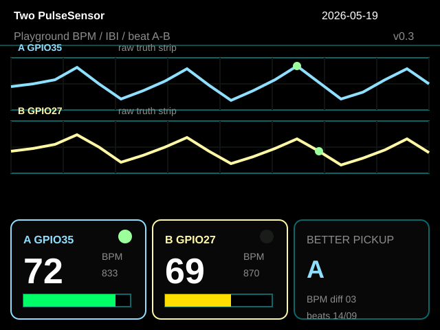

# CYD Two PulseSensor A/B Lab

This is a two-sensor PulseSensor experiment for the ESP32-2432S028 CYD touchscreen board. It compares two PulseSensor pickups side by side so you can see which one gives cleaner raw signal, steadier BPM/IBI timing, fewer false beat events, and better agreement over time.

The current build works as both:

- a standalone CYD instrument on the touchscreen
- an optional Chrome Web Serial dashboard for a larger lab view

> Educational signal-comparison demo only. Not for medical use.


## What This App Does

The project is trying to answer a simple hardware question:

```text
If two PulseSensors are connected at the same time,
which pickup is more believable right now?
```

It does that by showing the two sensors as `A` and `B`:

| Sensor | Color | Signal Pin | Purpose |
| --- | --- | --- | --- |
| A | light blue | `GPIO35` | first PulseSensor signal |
| B | light yellow | `GPIO27` | second PulseSensor signal |

The app compares both sensors through the same `PulseSensorPlayground` detector. It looks at raw waveform shape, BPM, IBI, beat timing, signal amplitude, lock quality, and solo beat events that might be false positives.

## What You See On The CYD

The CYD screen is meant to work by itself, without a laptop dashboard.



On the device:

- the top two strips are compact raw waveform views for A and B
- each sensor gets BPM and IBI from `PulseSensorPlayground`
- beat flashes show when the detector sees a beat
- quality bars show pickup confidence
- the verdict says which sensor looks better in the current window

The raw strips are the "truth view." If BPM looks odd, check whether the raw waveform looks believable.

## What You See In The Browser

The browser dashboard lives in:

```text
webserial.html
```

Run a local server:

```sh
cd /Users/narwhal2/Documents/CYD-Two-PulseSensor
python3 -m http.server 8765
```

Open:

```text
http://localhost:8765/webserial.html
```

In Chrome, Edge, or Brave, click `Connect` and choose the CYD serial port. The dashboard listens to compact `AB,...` telemetry from the CYD at 115200 baud.

The browser view is designed to be understandable with minimal reading:

| Color | Meaning |
| --- | --- |
| light blue | Sensor A / `GPIO35` |
| light yellow | Sensor B / `GPIO27` |
| green | A and B agree |
| orange | timing or BPM drift |
| red | solo beat suspect, possible false positive |

The most important browser panel is `Timing Agreement History`. It shows when the two sensors agree beat-to-beat, when they drift away, and when only one sensor reports an extra beat. The current winner is based on history, not just the latest number.

There is also a `Demo` button for layout testing without hardware. Future agents should use Demo mode for browser checks unless a human explicitly asks them to touch Web Serial.

## Pin Mapping Journey

This repo started from the one-sensor CYD app, then moved into a separate two-sensor repo after pin-scanner testing. The goal was to find two analog-capable pins that could read PulseSensor signals at the same time without breaking the CYD display.

The settled mapping is:

| PulseSensor Wire | Sensor A | Sensor B |
| --- | --- | --- |
| red | `3.3V` | `3.3V` |
| black | `GND` | `GND` |
| purple signal | `GPIO35` | `GPIO27` |

Use `3.3V`, not `5V`.

Why these pins:

- `GPIO35` behaved well as an analog input and became Sensor A.
- `GPIO27` behaved well as the second analog input and became Sensor B.
- Both worked together with `PulseSensorPlayground(2)` and the CYD screen.
- `GPIO22` did show raw scanner signal, but an earlier dashboard experiment using it caused a screen on/off reset loop. Avoid `GPIO22` for now.
- The current validated build successfully used `GPIO35` plus `GPIO27` for simultaneous CYD screen and browser telemetry testing.

This was the important hardware result: two PulseSensors could run at once while the CYD remained a functional standalone display.

## Current Firmware Behavior

Firmware entrypoint:

```text
PulseSensor_CYD.ino
```

Current detector setup:

| Setting | Value |
| --- | --- |
| detector | `PulseSensorPlayground(2)` |
| A signal | `GPIO35` |
| B signal | `GPIO27` |
| ADC resolution | 10-bit |
| threshold | `550` |
| serial baud | `115200` |
| telemetry interval | about 40 ms |

The firmware emits one compact line for the browser:

```text
AB,t,aSample,aBpm,aIbi,aQuality,aBeats,aAmp,aRange,aLocked,aBeat,bSample,bBpm,bIbi,bQuality,bBeats,bAmp,bRange,bLocked,bBeat,bpmDiff,winner
```

The CYD screen still runs while telemetry is being emitted. The browser dashboard is additive, not a replacement.

## Hardware Notes

Hardware used for the validated build:

| Part | Detail |
| --- | --- |
| board | `ESP32-2432S028` CYD |
| ESP32 chip seen while flashing | `ESP32-D0WD-V3`, revision `v3.1` |
| display | ILI9341 320x240 TFT |
| backlight | `GPIO21` |
| PulseSensor power | `3.3V` |
| PulseSensor ground | `GND` |

## Build And Flash

Build:

```sh
cd /Users/narwhal2/Documents/CYD-Two-PulseSensor
/Users/narwhal2/Library/Python/3.9/bin/pio run -e cyd
```

Flash:

```sh
cd /Users/narwhal2/Documents/CYD-Two-PulseSensor
/Users/narwhal2/Library/Python/3.9/bin/pio run -e cyd -t upload
```

Current local upload port:

```text
/dev/cu.usbserial-210
```

If flashing fails because the port cannot be opened, check whether Chrome is still connected to Web Serial. Chrome can hold `/dev/cu.usbserial-210`; click `Disconnect` in the dashboard or close the tab, then flash again.

## Current Validated State

Last pushed working state:

```text
commit: 374fc75 Add Web Serial A-B validation dashboard
tag: webserial-ab-validated-20260519-142635-EDT
date: 2026-05-19
```

What worked at this stage:

- CYD standalone A/B screen
- simultaneous A and B PulseSensor readings
- serial `AB,...` telemetry
- Chrome Web Serial dashboard
- raw overlap comparator
- timing agreement history
- green/orange/red trust visualization
- history-based winner
- IBI microscope
- demo mode

## Agent Handoff Notes

This repo is the active two-sensor build:

```text
origin: git@github.com:yury-g/CYD-Two-PulseSensor.git
```

Do not make changes in, push to, or use the original one-sensor launcher repo unless explicitly asked:

```text
do not push: git@github.com:yury-g/CYD_App_Launcher.git
```

Important details for future AI agents:

- The CYD should remain a standalone A/B instrument.
- The browser dashboard is an optional larger lab view.
- `webserial.html` intentionally starts with `Auto` unchecked.
- Do not reintroduce automatic serial probing on page load.
- In automated browser checks, use `Demo`; do not click `Connect` or turn on `Auto` unless the human explicitly asks.
- Avoid `GPIO22` for now because of the previous screen reset loop.
- Keep changes scoped to this repo, not the source launcher repo.

## Related Repos

- Active repo: [yury-g/CYD-Two-PulseSensor](https://github.com/yury-g/CYD-Two-PulseSensor)
- Original one-sensor source memory: [yury-g/CYD_App_Launcher](https://github.com/yury-g/CYD_App_Launcher)
- Pin scanner: [yury-g/CYD_Analog_Pin_Scanner](https://github.com/yury-g/CYD_Analog_Pin_Scanner)
