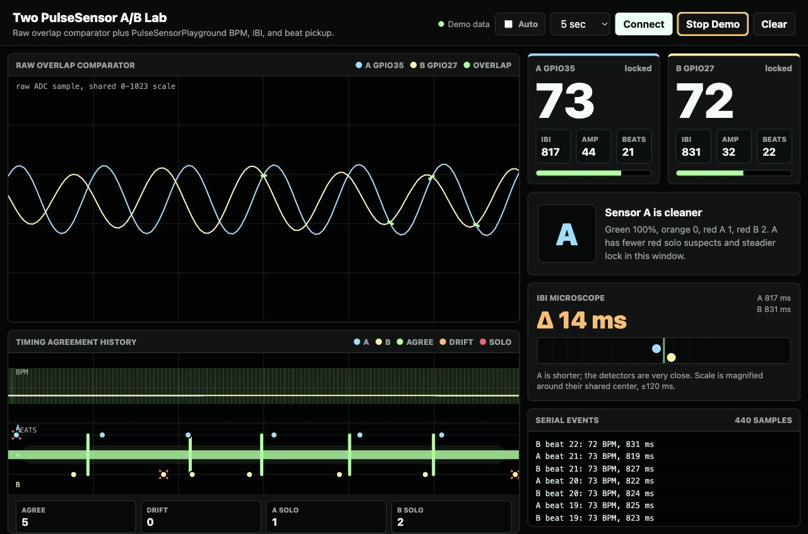

# CYD IR + Green PPG Testing

This branch is an experimental fork of the validated two-PulseSensor A/B build. It is for testing two different PPG light channels on the CYD:

- IR PPG signal on `GPIO35`
- green-light PPG signal on `GPIO27`

The goal of this branch is to compare pickup quality, pulse timing, raw waveform behavior, BPM/IBI stability, and an exploratory green/IR amplitude ratio.

> Important: this is not a medical device and does not calculate real blood oxygen. Classic pulse oximetry requires calibrated red + IR measurement. IR + green can be useful for PPG experimentation, but the current `G/IR` number is only an experimental signal ratio.

## Branch Status

Current branch:

```text
codex/ir-green-led-testing
```

This branch was created from the last validated A/B dashboard state:

```text
base commit: 374fc75 Add Web Serial A-B validation dashboard
base tag: webserial-ab-validated-20260519-142635-EDT
date: 2026-05-19
```

Current test state:

- Demo 2 firmware is the current build target for the connected CYD on `/dev/cu.usbserial-110`.
- The CYD screen title is `IR+Green PPG`.
- The CYD screen version label is `Demo2`.
- The screen explicitly says `no SpO2`.
- The right-side verdict panel reports `IR`, `GRN`, or `EVEN`.
- The bottom metric reports `G/IR`, an experimental green-amplitude / IR-amplitude percentage.
- This branch has not been pushed, so it is local/private unless pushed later.

Unfinished at this stage:

- The browser dashboard still comes from the A/B build and is not yet redesigned for IR/Green language.
- Serial telemetry still uses the existing `AB,...` format for compatibility.
- The `G/IR` ratio is not calibrated and should not be interpreted as oxygen saturation.
- No branch-specific screenshots have been captured yet.

## What Is Being Tested

The experiment asks:

```text
Can one CYD compare an IR PPG channel and a green PPG channel at the same time?
Which channel has cleaner pulse pickup under the current wiring and placement?
```

The CYD compares both channels through the same `PulseSensorPlayground` detector. It shows raw waveform strips, BPM, IBI, beat flashes, quality bars, and a cleaner-channel verdict.

## Current Wiring

| Sensor Channel | Light Type | Signal Pin | Power | Ground |
| --- | --- | --- | --- | --- |
| IR | infrared PPG | `GPIO35` | `3.3V` | `GND` |
| GRN | green-light PPG | `GPIO27` | `3.3V` | `GND` |

Use `3.3V`, not `5V`.

## Why These Pins

The underlying A/B project came from a pin-mapping journey on the CYD:

- `GPIO35` behaved well as an analog input and became the first stable PPG channel.
- `GPIO27` behaved well as the second analog input.
- Both worked together with `PulseSensorPlayground(2)` while the CYD screen stayed functional.
- `GPIO22` did show raw signal during scanner testing, but an earlier dashboard experiment using it caused a screen on/off reset loop. Avoid `GPIO22` for now.

That earlier result gave us a known-good two-channel analog base. This branch reuses that base, but changes the meaning of the channels from generic A/B PulseSensors to IR/Green PPG.

## What You See On The CYD

Demo 2 is meant to run on the CYD as a standalone test instrument.

On the screen:

- `IR GPIO35` is the IR PPG channel.
- `GRN GPIO27` is the green PPG channel.
- The two raw waveform strips are the main truth view.
- BPM and IBI are still produced by `PulseSensorPlayground`.
- Beat flashes show detector events.
- Quality bars show pickup confidence.
- `CLEANER PPG` reports the channel with the stronger current quality score.
- `G/IR` shows green amplitude divided by IR amplitude as a percent.

The header says `no SpO2` on purpose. This branch should stay honest about what the sensors can and cannot determine.

## What Remains From The A/B Build

This branch still inherits the Web Serial lab page:

```text
webserial.html
```

Run it locally:

```sh
cd /Users/narwhal2/Documents/CYD-Two-PulseSensor
python3 -m http.server 8765
```

Open:

```text
http://localhost:8765/webserial.html
```

The dashboard still displays A/B wording because it was built for the previous two-PulseSensor comparison. It can still visualize the serial stream, but it has not yet been renamed or redesigned for IR/Green testing.

The old A/B visual reference is still useful as project history:



## Firmware Behavior

Firmware entrypoint:

```text
PulseSensor_CYD.ino
```

Current Demo 1 detector setup:

| Setting | Value |
| --- | --- |
| detector | `PulseSensorPlayground(2)` |
| IR signal | `GPIO35` |
| green signal | `GPIO27` |
| ADC resolution | 10-bit |
| threshold | `550` |
| serial baud | `115200` |
| telemetry interval | about 40 ms |

Serial telemetry remains:

```text
AB,t,aSample,aBpm,aIbi,aQuality,aBeats,aAmp,aRange,aLocked,aBeat,bSample,bBpm,bIbi,bQuality,bBeats,bAmp,bRange,bLocked,bBeat,bpmDiff,winner
```

For this branch, interpret `a*` fields as IR and `b*` fields as green until the browser/telemetry naming is updated.

## Build And Flash

Build:

```sh
cd /Users/narwhal2/Documents/CYD-Two-PulseSensor
/Users/narwhal2/Library/Python/3.9/bin/pio run -e cyd
```

Flash the currently connected test CYD:

```sh
cd /Users/narwhal2/Documents/CYD-Two-PulseSensor
/Users/narwhal2/Library/Python/3.9/bin/pio run -e cyd -t upload --upload-port /dev/cu.usbserial-110
```

The previous A/B CYD often appeared as:

```text
/dev/cu.usbserial-210
```

Check ports before flashing:

```sh
/Users/narwhal2/Library/Python/3.9/bin/pio device list
```

If flashing fails because the port cannot be opened, check whether Chrome is connected to Web Serial. Chrome can hold the serial port; click `Disconnect` in the dashboard or close the tab, then flash again.

## Hardware Notes

Hardware used for the validated base build and this branch:

| Part | Detail |
| --- | --- |
| board | `ESP32-2432S028` CYD |
| ESP32 chip seen while flashing | `ESP32-D0WD-V3`, revision `v3.1` |
| display | ILI9341 320x240 TFT |
| backlight | `GPIO21` |
| sensor power | `3.3V` |
| sensor ground | `GND` |

## Agent Handoff Notes

For future agents:

- This branch is experimental IR/Green PPG testing, not the finished A/B mainline.
- Do not claim or imply that IR + green determines blood oxygen.
- Keep `GPIO35` as IR and `GPIO27` as green unless the human explicitly changes wiring.
- Keep `GPIO22` avoided for now because of the earlier reset-loop behavior.
- The Web Serial dashboard is inherited and not yet branch-specific.
- In automated browser checks, use Demo; do not click `Connect` or turn on `Auto` unless the human explicitly asks.
- Do not push this branch unless the human asks; it is intended to stay local/private for now.
- Do not push to the original one-sensor repo.

Active repo:

```text
origin: git@github.com:yury-g/CYD-Two-PulseSensor.git
```

Do not push:

```text
git@github.com:yury-g/CYD_App_Launcher.git
```

## Related Repos

- Active repo: [yury-g/CYD-Two-PulseSensor](https://github.com/yury-g/CYD-Two-PulseSensor)
- Original one-sensor source memory: [yury-g/CYD_App_Launcher](https://github.com/yury-g/CYD_App_Launcher)
- Pin scanner: [yury-g/CYD_Analog_Pin_Scanner](https://github.com/yury-g/CYD_Analog_Pin_Scanner)
