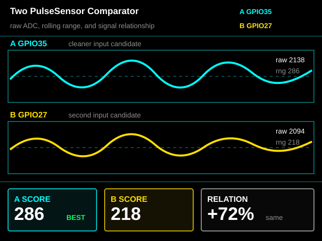

# CYD Two PulseSensor Comparator

Experimental ESP32-2432S028 CYD firmware for comparing two PulseSensor signal inputs side by side.

This repo was cloned from `yury-g/CYD_App_Launcher` on 2026-05-19 after raw pin-scanner testing showed `GPIO35` and `GPIO27` as the best two PulseSensor signal candidates on the connected CYD hardware.

> Educational signal-comparison demo only. Not for medical use.

## Current Mapping

| PulseSensor | Red | Black | Purple Signal |
| --- | --- | --- | --- |
| A | `3.3V` | `GND` | `GPIO35` |
| B | `3.3V` | `GND` | `GPIO27` |

Use `3.3V`, not `5V`.

## What The Screen Shows

- Top trace: raw `GPIO35`
- Bottom trace: raw `GPIO27`
- Rolling raw value and range for each channel
- `BEST` badge for the channel with the stronger non-railed signal
- `REL` percentage showing how much the two signals move together

Rendered design reference:



The first version intentionally reads raw ADC values instead of using PulseSensorPlayground. The goal is to learn which wire/pin/sensor gives the cleaner signal before building two-channel beat detection.

## Build And Flash

```sh
cd /Users/narwhal2/Documents/CYD-Two-PulseSensor
/Users/narwhal2/Library/Python/3.9/bin/pio run -e cyd
/Users/narwhal2/Library/Python/3.9/bin/pio run -e cyd -t upload
```

The current local upload port is:

```text
/dev/cu.usbserial-210
```

## Hardware Notes

- Board: `ESP32-2432S028` CYD
- ESP32 chip seen while flashing: `ESP32-D0WD-V3`, revision `v3.1`
- Display: ILI9341 320x240 TFT
- Backlight: `GPIO21`
- Candidate signal pins from scanner testing:
  - Best pair: `GPIO35`, `GPIO27`
  - Also showed raw signal: `GPIO22`
  - Avoid for dashboard input for now: `GPIO22`, because one dashboard experiment caused a screen on/off reset loop

## Related Repos

- Source experiment memory: [yury-g/CYD_App_Launcher](https://github.com/yury-g/CYD_App_Launcher)
- Pin scanner: [yury-g/CYD_Analog_Pin_Scanner](https://github.com/yury-g/CYD_Analog_Pin_Scanner)
